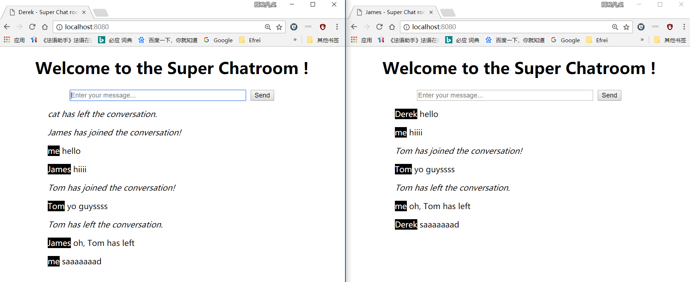
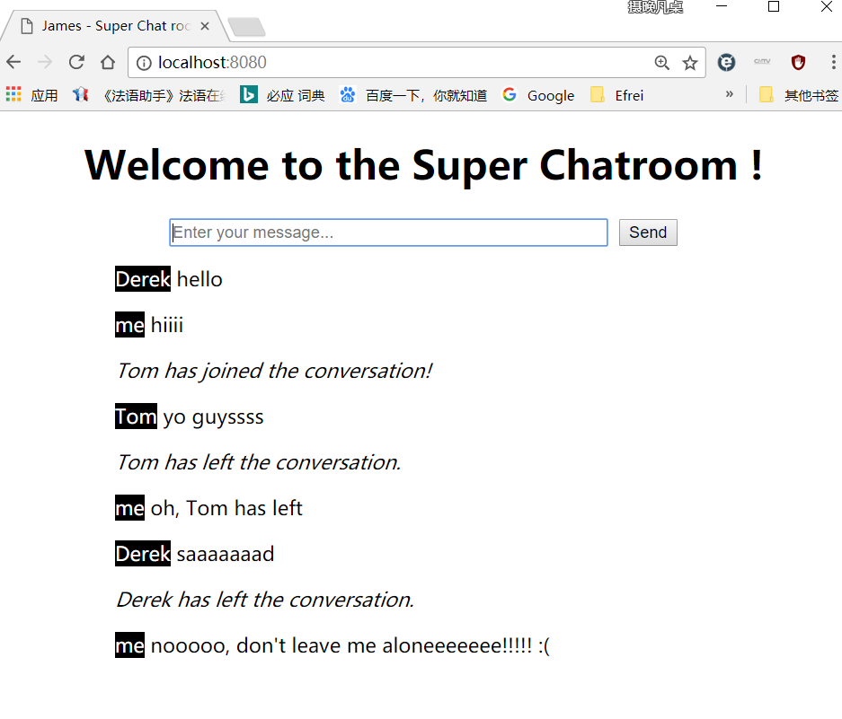

# Chatroom
A simple real-time chat room based on node.js/socket.io.

### We can have multiple users joining the chat room for real time online chatting.

### Users sending each other some messages and having the messages received and displayed in their own interface.

### A user can see other users' nicknames displayed before there messages, and his own nickname will be replaced by "me". And a prompt message will be displayed on the history when a user joins or leaves the chatroom.

